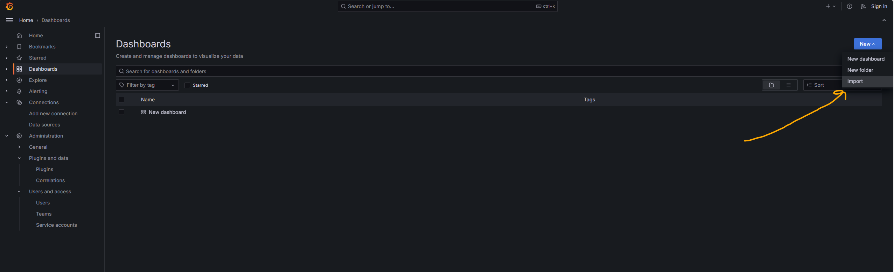

# Mavlink Grafana Telemetry Dashboard

This project links together a few tools to diplay live mavlink data in Grafana which is an enterprise data visualisation tool. Grafana allows extremely flexible data display & transformations, rapidly!

This is great for understanding lots of sensor data at once during flight testing. Grafana supports many different display types, changing colour based on data values, doing data transforms in Flux query laguage and more.


## Example dashboard


How it works:
- mavlink2influx module reads in MAVLINK data and converts it to an influxDB submission
- InfluxDB stores the data in a database
- Grafana reads in the data from InfluxDB

Although this is slightly resource intensive, it is extremely flexible and leverages powerful industry standard tools.

Contact **admin@beyondrobotix.com** for any help creating dashboards and working with Mavlink data. We can also assist with engineering technical work. 

[Beyond Robotix Website](https://www.beyondrobotix.com/)


## Usage

1. Installer docker https://docs.docker.com/desktop/
2. Set Mavlink settings in mavlink2influx/dockerfile (MAVLINK_ADDRESS & MAVLINK_PORT)
- Use host.docker.internal in place of localhost
- Currently connects to TCP server
- Default settings connect to Ardupilot mission planner SITL
3. Run compose
```
docker compose up
```
4. Open "localhost:3000" in your web browser, that should take you to the Grafana dashboard
5. configure grafana data source, in the left menu (Connections -> Add new connection)


6. Setup a dashboard, there's an "example_dashboard.json" in the root of this repo




7. watch data !

## Todo

- support multi-vehicle use, Make the mavlink2influx grab a unique aircraft identifier or use MAV_ID for the influxDB tag submission
- sort out dashboard folder link, currently need to import the dashboard.json file manually
- handle GCS status messages, they currently aren't stored in Influx
